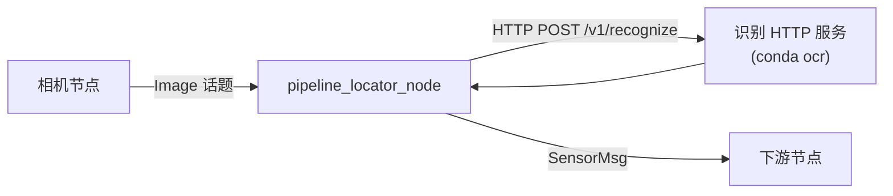

# screen_ocr_ros2

管线探测仪（管线仪）LCD 屏幕识别的 **ROS2 Humble 工作区**。识别逻辑与 ROS 节点**分离部署**：识别服务跑在 conda 环境，ROS 侧为轻量 **C++ HTTP 桥接节点**，适合 arm64 机器狗等场景，避免 Python `numpy` / `opencv-python` 与 ROS 运行时 ABI 冲突。

| 组件 | 目录 | 运行环境 | 职责 |
|------|------|----------|------|
| 识别 HTTP 服务 | `recognition_service/` | conda `ocr` | 图像识别、标定配置、数字模板 |
| ROS2 节点 | `src/screen_ocr/` | 系统 ROS2 Humble (C++) | 订阅图像 → HTTP 请求 → 发布 `SensorMsg` |
| 自定义消息 | `src/screen_ocr_msgs/` | 系统 ROS2 | 定义 `SensorMsg` |



识别服务详细说明见 [recognition_service/README.md](recognition_service/README.md)。  
完整依赖清单见 [DEPENDENCIES.md](DEPENDENCIES.md)。

## 仓库结构

```
screen_ocr_ros2/                    # colcon 工作区根目录
├── src/
│   ├── screen_ocr_msgs/            # 自定义消息 SensorMsg
│   └── screen_ocr/                 # ROS2 节点包（C++）
│       ├── include/screen_ocr/     # 头文件
│       ├── src/                    # 节点与 HTTP/映射实现
│       ├── config/pipeline_locator.yaml
│       └── launch/pipeline_locator.launch.py
├── recognition_service/            # 识别服务（COLCON_IGNORE，不参与 colcon）
├── scripts/
│   └── install_ros_deps.sh         # ROS 侧 apt 依赖一键安装
├── DEPENDENCIES.md
└── README.md
```

## 依赖安装

### ROS2 侧（编译与运行节点）

```bash
./scripts/install_ros_deps.sh
```

或参见 [DEPENDENCIES.md](DEPENDENCIES.md) 手动安装 `ros-humble-*`、`libcurl`、`nlohmann-json` 等。

### 识别服务侧（conda）

```bash
cd recognition_service
conda env create -f environment.yml   # 环境名: ocr
conda activate ocr
```

## 快速开始

需要**两个终端**：识别服务（conda）与 ROS 节点（系统 ROS）。

### 终端 1：识别 HTTP 服务

```bash
cd recognition_service
conda activate ocr
./start_api_server.sh
```

验证：

```bash
curl http://127.0.0.1:8000/health
```

### 终端 2：ROS2 节点

```bash
conda deactivate
source /opt/ros/humble/setup.bash
cd ~/screen_ocr_ros2
colcon build
source install/setup.bash
ros2 launch screen_ocr pipeline_locator.launch.py
```

查看输出：

```bash
ros2 topic echo /pipeline_locator/sensor
```

## ROS2 节点

### 启动

```bash
ros2 launch screen_ocr pipeline_locator.launch.py
```

指定配置：

```bash
ros2 launch screen_ocr pipeline_locator.launch.py \
  config_file:=/path/to/pipeline_locator.yaml
```

### 参数

配置文件：`src/screen_ocr/config/pipeline_locator.yaml`（安装后位于 `share/screen_ocr/config/`）

| 参数 | 说明 | 默认值 |
|------|------|--------|
| `image_topic` | 订阅的图像话题 | `/image_raw` |
| `image_type` | `raw` 或 `compressed` | `raw` |
| `output_topic` | 识别结果发布话题 | `/pipeline_locator/sensor` |
| `inference_rate_hz` | 请求识别服务的频率 (Hz) | `2.0` |
| `output_frame_id` | 输出 `SensorMsg.header.frame_id`；留空则沿用相机图像 | `pipeline_locator` |
| `api_base_url` | 识别 HTTP 服务地址 | `http://127.0.0.1:8000` |
| `api_timeout_sec` | HTTP 超时（秒） | `5.0` |
| `debug` | 识别服务是否保存调试图 | `false` |
| `qos_reliability` | `best_effort` / `reliable` | `best_effort` |
| `qos_history_depth` | 图像订阅队列深度 | `1` |

工作流程：

1. 订阅 `image_topic`，缓存最新一帧
2. 按 `inference_rate_hz` 取最新帧，编码为 JPEG（`compressed` 类型可直接转发 JPEG 字节）
3. `POST {api_base_url}/v1/recognize` 获取 JSON（扁平字段，见下表）
4. 转换为 `screen_ocr_msgs/msg/SensorMsg` 并发布（`header.stamp` 沿用所识别那一帧相机图像的时间戳）

识别 API 响应示例（`POST /v1/recognize` 成功时直接返回扁平 JSON，无 `success` / `data` 包装）：

```json
{
  "signal_strength_percent": 5.7,
  "depth_meters": null,
  "current_milliamps": 220,
  "pipeline_heading_degrees": 0.0,
  "left_arrow": false,
  "right_arrow": false
}
```

请求失败时返回 HTTP 4xx/5xx，body 为 `{"detail": "..."}`。C++ 节点仅在 HTTP 2xx 且 JSON 可解析时发布 `SensorMsg`。

**arm64 建议**：若相机发布 `sensor_msgs/CompressedImage`，设置 `image_type: "compressed"`，可跳过 OpenCV 解码，进一步降低运行时依赖风险。

### 消息 `screen_ocr_msgs/msg/SensorMsg`

```
std_msgs/Header header
geometry_msgs/Vector3 magnetic_field
float64[9] magnetic_field_covariance
float32 signal_strength
float32 depth_meters
float32 current_milliamps
float32 pipeline_heading_degrees
float32 signal_strength_percent
bool left_arrow
bool right_arrow
```

| SensorMsg 字段 | 识别 API 字段 |
|----------------|---------------|
| `header.stamp` | 相机图像 `header.stamp`（非节点当前时间） |
| `header.frame_id` | `output_frame_id` 参数；留空则沿用相机 |
| `signal_strength_percent` | `signal_strength_percent` |
| `signal_strength` | `signal_strength_percent / 100` |
| `current_milliamps` | `current_milliamps` |
| `depth_meters` | `depth_meters` |
| `pipeline_heading_degrees` | `pipeline_heading_degrees` |
| `left_arrow` / `right_arrow` | `left_arrow` / `right_arrow` |
| `magnetic_field` | 由 `pipeline_heading_degrees` 转换的单位方向向量 |

## 常见问题

| 现象 | 原因 | 处理 |
|------|------|------|
| `colcon build` 报 `No module named 'em'` | conda 干扰 ROS 构建 | `conda deactivate` 后重编 |
| 运行时 `numpy` / `opencv` ABI 报错 | Python 与 ROS 库混用 | 使用 C++ 节点；运行 ROS 时勿 `conda activate` |
| `Could NOT find nlohmann_json` | 缺少 JSON 库 | `sudo apt install nlohmann-json3-dev` |
| `Could NOT find CURL` | 缺少 libcurl | `sudo apt install libcurl4-openssl-dev` |
| `Recognition failed` | 识别服务未启动或 HTTP/JSON 失败 | 检查 `curl http://127.0.0.1:8000/health` 与 `api_base_url`；确认 `/v1/recognize` 返回 2xx |
| `Waiting for image` | 无图像话题 | 检查相机节点与 `image_topic` |
| 识别结果全为 NaN | 标定或图像问题 | 检查 `recognition_service/config/` |
| CLI 默认图片读取失败 | 未在 `recognition_service/` 下运行或路径错误 | 示例图为 `examples/images/image0000001.png`（`.png`，非 `.jpg`） |

## License

MIT
